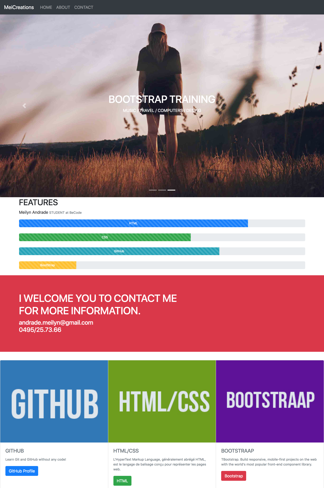

## Bootstrap
### Introduction

Utilisation du Bootstrap (Framework CSS). Comme moyen de développement rapide pour le frontend. ça permet de récupér des solutions toutes faites à des problèmes courants du développement Frontend :

### Exercices

* faire une grille responsive
* faire un menu responsif
* styliser un formulaire et ses inputs
* normaliser la typographie
* éléments interfaces "riches": carrousels, jumbo menu, ... 

[Website](https://meilyn.github.io/bootstrap-training/)

